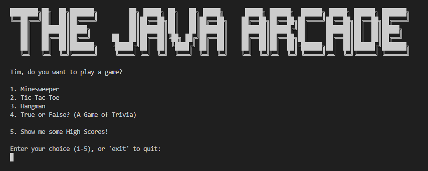

<h2>Hello, World!  I'm <a href="https://tim-broderick.com/">Tim!</a> 👋 </h2>
<h3>I'm a motivated full-stack developer who's keen to learn some new skills.</h3>

<p>With the help and guidance of <strong><a href="https://au.nology.io/">_Nology, Australia</a></strong>, I'm currently working towards breaking into the tech industry. I've been working on a few different projects lately, spending 100s of hours in Baldur's Gate III and drinking WAY too much coffee ☕! </p>


<p>Thanks for stopping by! Hope you can find something you enjoy!</p>  

- 💻 I'm now working on my <strong><a href="https://github.com/TimBroderick44/Simple-Stock-Analysis">Apple Vs. Microsoft</a></strong> project. (Check it out!)
- 🌱 I’m currently learning **Python, Spark & AWS Services** (difficult but rewarding!)
- 👨‍💻 My Portfolio and CV are available at <strong><a href="https://tim-broderick.com/">tim-broderick.com</a></strong>
- 📫 How to reach me **timbroderick44@gmail.com**

<h3 align="left">About me:</h3>

```diff
- I used to be an ESL teacher teaching Japanese and Korean students.
+ I'm a full-stack developer now!

- I lived in Japan
+ I'm back in Sydney now 🦘

- I am not a geek. 🤓
+ I am a massive geek who loves video games and learning about technology.

- I thought I wouldn't be able to break into tech
+ I've exceeded all my goals and have made some really cool stuff!
```

For the full story, please check out my portfolio @ [https://tim-broderick.com/](https://tim-broderick.com/)

<h2> GitHub Stats </h2> 

<a href="https://github.com/anuraghazra/github-readme-stats">
  
</a>

<h2 >🎮 Top Projects: 🏆</h2>

<table>
  <tr>
    <td>
      <h3 align="center"> Retro Cult Games: </h3>
        <a href="https://github.com/TimBroderick44/retro-cult-eshop">
          
        </a>
        <p align="center">Uses: React, SCSS, Firebase </p>
        <p align="center"><a href="https://tim-broderick.com/RetroCult/">Live Site</a></p>
    </td>
    <td>
      <h3 align="center"> Google API Search: </h3>
      <a href="https://github.com/TimBroderick44/google-books/tree/develop">
        
      </a>
      <p align="center">Uses: React, SCSS</p>
      <p align="center"><a href="https://tim-broderick.com/Bookoogle/">Live Site</a></p>
    </td>
    <td>
      <h3 align="center"> Java Arcade: </h3>
      <a href="https://github.com/TimBroderick44/Java-Arcade">
        
      </a>
        <p align="center"> Uses: Java </p>
        <p align="center"><a href="https://github.com/TimBroderick44/Java-Arcade">Source Code</a></p>
    </td>
    <td>
      <h3 align="center"> FakeOS (Win98): </h3>
      <a href="https://github.com/TimBroderick44/fakeOS">
        
      </a>
      <p align="center">Uses: JS, HTML, SCSS </p>
      <p align="center"><a href="https://tim-broderick.com/fakeOS/">Live Site</a></p>
    </td>
  </tr>
</table>

<h2 align="left">Languages and Tools:</h3>

  <h3> General Programming: </h3>

  [](https://skillicons.dev)

  <h3> Web Development : </h3>

  [](https://skillicons.dev)

  <h3> Other Skills : </h3>

  [](https://skillicons.dev)


 

 

 
